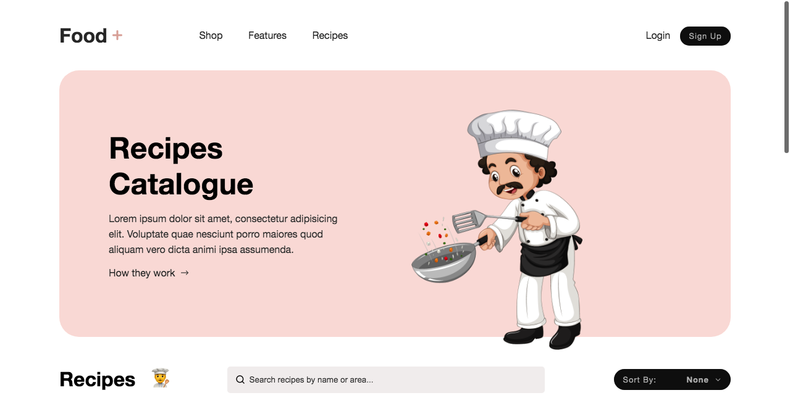
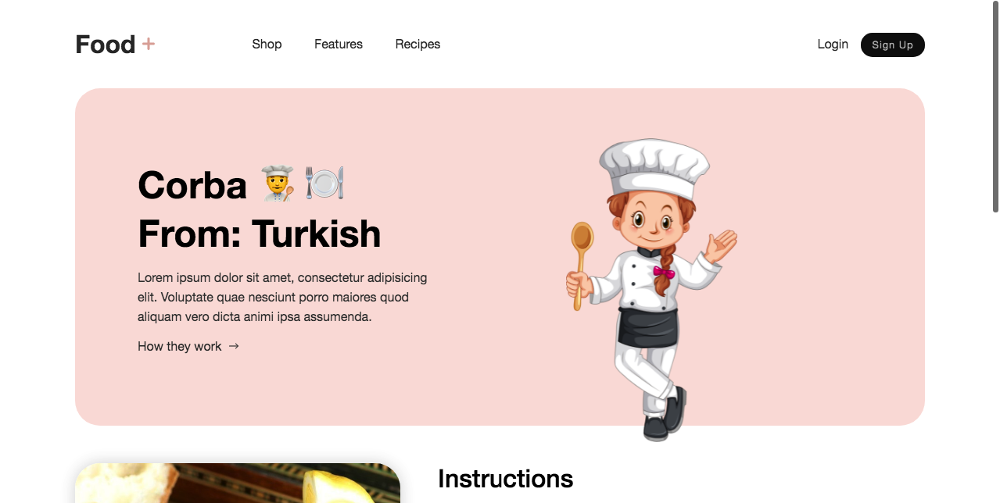
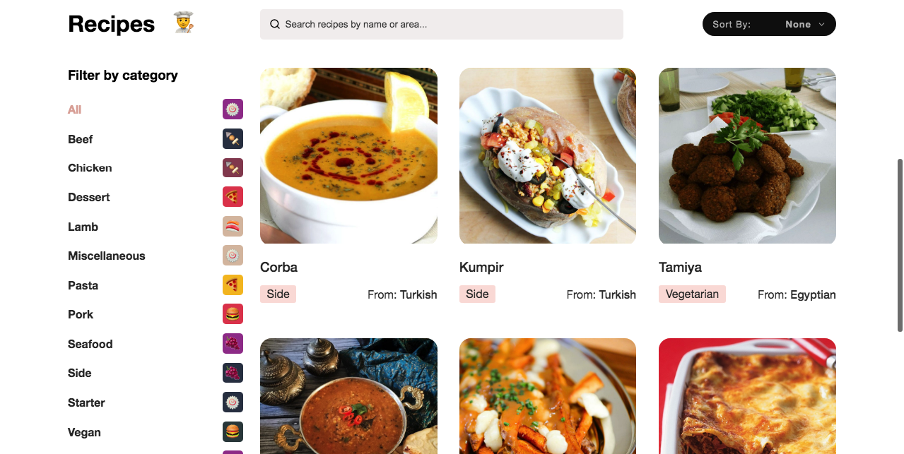

# Sweet~aromas

> Sweet~aromas is a catalogue of Recipes that provides a set of instructions used for preparing and producing a certain food, dish, or drink. The purpose of a recipe is to have a precise record of the ingredients used, the amounts needed, and the way they are combined.

### Screenshots 📸

|-| Sweet~aromas |-|
|-|----------------------------------|-|
|-|  |-|
|-| |-|
|-|  |-|
|-| |-|
|-|  |-|
|-| |-|
|-|  |-|


## Built With 🛠️

- 
- 
- 
- 

## Live Demo 🔗

[Live Demo Link](https://recipes-catalogue-plus.netlify.app/recipes/)

## Documentation Demo 🔗

[Documentation Link](https://sweetaromas.herokuapp.com/api-docs/)

<!-- ## TheMealDB

[API Link](https://www.themealdb.com/api.php ) -->

## Getting Started

### Clone this repository

- To get the content of this project locally you need to run this command in your terminal:

```bash
$ git git clone https://github.com/barackm/catalogue-of-recipes.git
$ cd catalogue-of-recipes
```
### Run project

- After cloning the project you need to run this command In the project directory:

```bash
$ npm install
$ npm run start 
```

Runs the app in the development mode.\
Open [http://localhost:3000](http://localhost:3000) to view it in the browser.

### Install **ESLint** & **Stylelint** linter

* To instal RSpec for testing please run the following command on your terminal:

```bash
$  npm install --save-dev eslint@7.x eslint-config-airbnb@18.x eslint-plugin-import@2.x eslint-plugin-jsx-a11y@6.x eslint-plugin-react@7.x eslint-plugin-react-hooks@4.x @babel/eslint-parser@7.x @babel/core@7.x  @babel/plugin-syntax-jsx@7.x  @babel/preset-react@7.x @babel/preset-react@7.x

```

```bash
$  npm install --save-dev stylelint@13.x stylelint-scss@3.x stylelint-config-standard@21.x stylelint-csstree-validator@1.x

```

- To run the tests locally :

```bash
$  npx eslint .
$  npx stylelint "**/*.{css,scss}" 
```

- Automatic fix

```bash
$  npx eslint . --fix 
$  npx stylelint "**/*.{css,scss}" --fix 
```


## Authors

👤 **Barack Mukelenga**

- GitHub: [@barackm](https://github.com/barackm)
- Twitter: [@BarackMukelenga](https://twitter.com/BarackMukelenga)
- LinkedIn: [Baraka Mukelenga](https://www.linkedin.com/in/baraka-mukelenga/)
- Portfolio: [Barackm](https://barackm.me)

👤 **Ben Mukebo**

- GitHub: [@BenMukebo](https://github.com/BenMukebo)
- Twitter [@BenMukebo](https://twitter.com/BenMukebo)
- LinkedIn [BenMukebo](https://www.linkedin.com/in/kasongo-mukebo-ben-591720205/)


## 🤝 Contributing

Contributions, issues, and feature requests are welcome!

Feel free to check the [issues page](https://github.com/barackm/catalogue-of-recipes/issues).

## Show your support

Give a ⭐️ if you like this project! ❤️

## Acknowledgments

- Microverse
- [Cuberto](https://dribbble.com/cuberto) for the design inspiration

## License

The MIT License (MIT)

Copyright (c) 2021 [Baraka Mukelenga](https://barackm.me)

Copyright (c) 2022 [Ben Mukebo](https://www.benmukebo.me/
